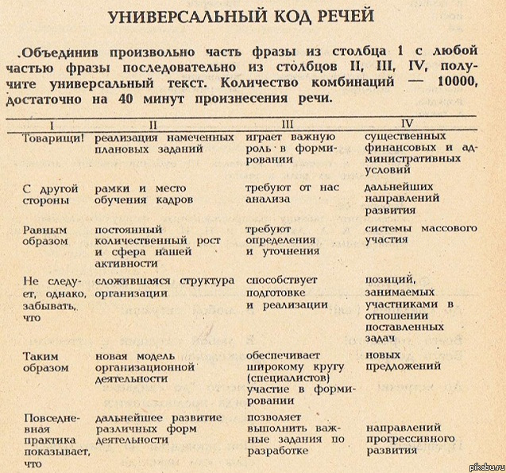

# Russian Speech Code

Generates a random russian text using russian universal speech code that looks like this:



## Installation

```
npm install speech-code
```

## Usage

```js
import { getText, getParagraph, getSentence } from 'speech-code'

const sentence = getSentence()
const englishSentence = getSentence('en')
const text = getText()
const paragraph = getParagraph(5)
const englishParagraph = getParagraph(4, 'en')
const textByCharacters = getCharacters(1000)

console.log(`Sentence: ${sentence}. In english: ${englishSentence}`)
console.log(`Text: ${text}`)
console.log(`Paragraph: ${paragraph}. In english: ${englishParagraph}`)
console.log(`Text by characters: ${textByCharacters}`)
```

### cli

```sh
npx speech-code text 3
npx speech-code paragraph 4
npx speech-code sentence
npx speech-code char 1000  # the length of resulting text will never be equal to specified value. It might be either shorter or longer

# You can also use shorter version of types
npx speech-code t 3
npx speech-code p 4
npx speech-code s
npx speech-code c 1000

# Not specifying type and amount returns a paragraph with 3 sentences by default
npx speech-code
```

You can also specify the language of the text in an optional third argument. Accepted languages are `ru` and `en`. Default language is Russian.

```sh
npx speech-code text 3 ru
npx speech-code sentence 2 en
```